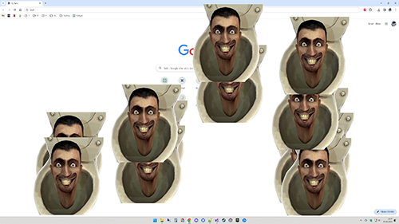

## Skibbedi - Narr en venn med litt skibbedi toilet  

Tulleprogram som tar utgangspunkt i mye WASD knappetrykking.  

  
   
   
På tilfeldige tidspunkt i mange spill er det uunngåelig at AWD vil bli trykket ned på likt, 
i dette tilfellet vil programmet produsere en skibbedi toilet og sang. Uforståelig noe dagens 
generasjon synes er svært artig... Så mest for ungene sin skyld.

Når man har spøkt nok, er det bare å holde nede L+O+V for å avslutte programmet, som er alenestående og krever ingen installering.  

Et batch skript medfølger som man kan bruke for å kopiere inn programmet i oppstartsmappen til den man skal spøke med, 
men funker også fint ved å bare kjøre den. Den vil skjule seg fra oppgavelinjen men være synlig i oppgavebehandling hvis 
man vil tvinge det av eller sjekke at det kjører.  

**Hvis du bruker skriptet for automatisk oppstart, kan du bare fjerne det herfra igjen:**  
```C:\ProgramData\Microsoft\Windows\Start Menu\Programs\StartUp```